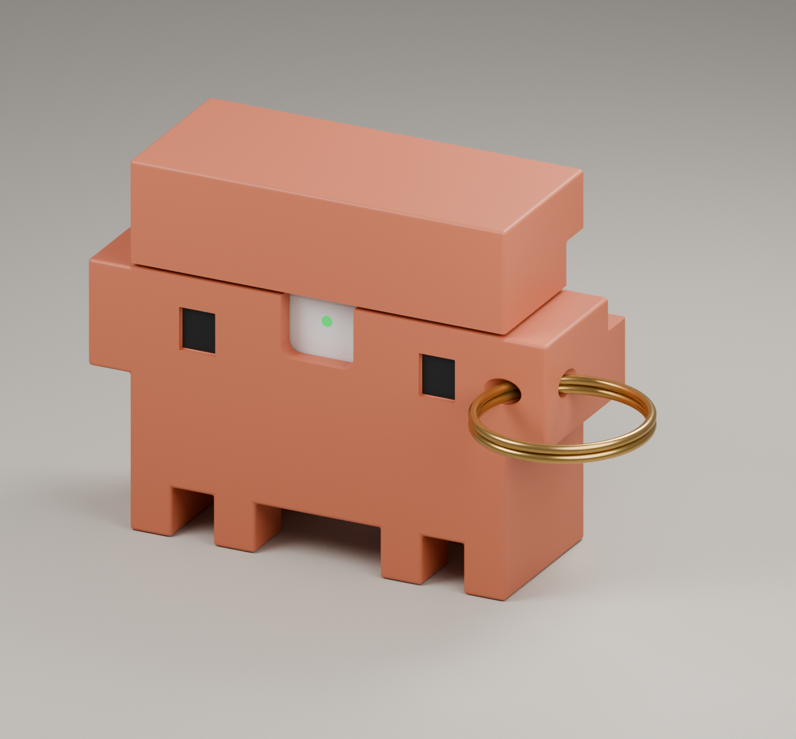
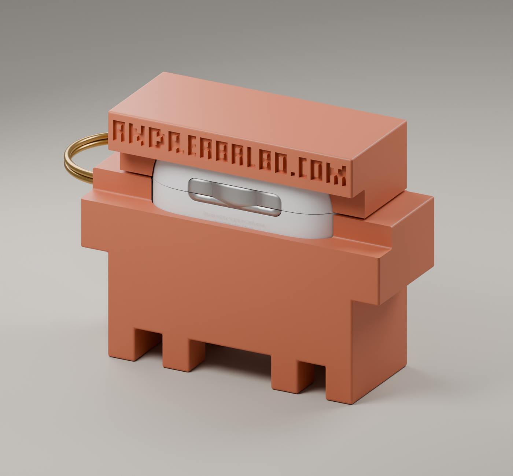

# Clawd AirPods 4 ANC Case

**Open, editable CAD for a Clawd-inspired protective cover — not just an STL.**

[Italiano](docs/README.it.md) · [Print files](exports/clawd-v03/clawd-prototype/) ·
[Editable Blender source](models/clawd-airpods4-anc-v03.blend) ·
[Build from source](docs/BUILD.md) · [Licenses and credits](LICENSE.md)



> **v0.3.0-alpha / design v03 — WORK IN PROGRESS.** No physical print or
> actual-device fit test has been completed. Digital mesh and surrogate
> clearance checks are not proof of fit, retention, charging performance or
> keyring strength. Do not treat this as a production-ready product or trust
> an untested cover to carry your AirPods. [Qualification checklist →](docs/QUALIFICATION.md)

## What it is

A two-piece, removable outer cover for the **existing AirPods 4 with Active
Noise Cancellation charging case**. It is not a replacement charging case,
electronics project or certified protective accessory.

- Clawd-inspired blocky body, four legs and recessed eyes.
- Separate slip-on body and lid; no positive device or lid lock is claimed.
- Rear `andreabalbo.com` pixel engraving, nominally 1.0 mm deep.
- A rounded, diagonal Ø4 mm bore on the viewer-right block for a metal split ring.
- Front access, rear hinge relief and bottom USB-C / ANC-speaker service opening.
- Terracotta/orange with black eyes is a finish reference, not a matched material color.

Only the **two plastic parts** are print deliverables. The AirPods model, eye
paint previews, metal ring, floor, cutters and source assets must not be printed.
The ring shown is illustrative; no hardware is included or specified as load-rated.



All gallery images are CAD renders, not photographs of a tested print.

## Start here

1. Read [PRINTING.md](docs/PRINTING.md) before paying for a print.
2. Download **one body + one lid** from `exports/clawd-v03/clawd-prototype/`.
   Use **either the two STLs or the two-part 3MF**, not both sets.
3. Select millimetres and 100% scale. Ask your printer to review walls, cavity
   tolerance, engraving and keyring geometry for its specific process.
4. Print an unpainted prototype first. Validate it on the real device before
   paying for color finishing or treating it as a usable carrying accessory.

| Item | Nominal CAD dimensions, mm |
| --- | --- |
| Body STL | 75.78 × 26.90 × 42.40 |
| Lid STL | 62.00 × 26.90 × 16.50 |
| Closed plastic assembly, excluding hardware | 75.78 × 26.90 × 59.60 |
| Cavity clearance relative to visual surrogate | 0.35 normal offset |
| Keyring bore | Ø4.00 |

Dimensions are CAD values, not measured finished parts or toleranced drawings.
The 3MF contains meshes and explicit millimetre units, **not a validated printer profile**.

## Source and remixing

Open `models/clawd-airpods4-anc-v03.blend` in Blender **5.2.1 LTS** (the version
used for this release). The file retains print parts, masters, cutters, fit-check
parts, credited visual references and presentation objects in named collections.
One Blender coordinate unit represents 1 mm; scene `scale_length` is 0.001.

The Python construction history and JSON parameters are included. A clean
rebuild needs Blender and Python, not Codex, Claude Code or a running MCP server:

```sh
python3 tools/rebuild.py --blender /path/to/blender --output /path/to/new-empty-build
```

See [BUILD.md](docs/BUILD.md) for the v01 → v02 → v03 parameter dependencies,
supported lettering and reproducibility limits. Editing JSON does **not** update
the already-exported meshes automatically. Regenerate and revalidate changes.

## Contribute

Useful contributions include measured-device fit reports, printer/process
tolerance results, non-destructive retention improvements, keyring testing,
lettering improvements and accessible printing instructions. Use the issue
templates and [contribution guide](CONTRIBUTING.md). Failed prototypes are useful
data when material, process, scale and exact revision are recorded.

Please do not upload restricted reference assets, proprietary CAD, personal
shipping details, supplier correspondence or someone else's unlicensed designs.

## Open licensing and attribution

- **CAD, parameters, documentation and renders:** CC BY-SA 4.0 for our contributions.
- **Python tools and CI:** MIT.
- **Original Clawd and AirPods source assets:** CC BY 4.0, with author credits.

Both project licenses permit commercial reuse under their terms. That does not
grant trademark or endorsement rights. This is **unofficial fan work**, not an
Apple or Anthropic product. Read [LICENSE.md](LICENSE.md) and preserve
[THIRD_PARTY_NOTICES.md](THIRD_PARTY_NOTICES.md), including the credits to
**akmiller01** and **Falah3D**. Non-open donor-case files are excluded from this
repository, the public blend and the rebuild dependencies.

Designed by [Andrea Balbo](https://andreabalbo.com), with AI-assisted Blender
scripting and modelling. Geometry checks are automated; physical validation is
still a human, real-device task. The license does not provide a warranty.
